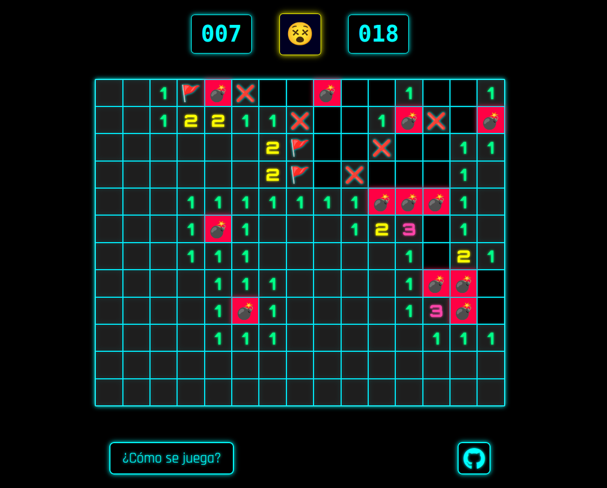
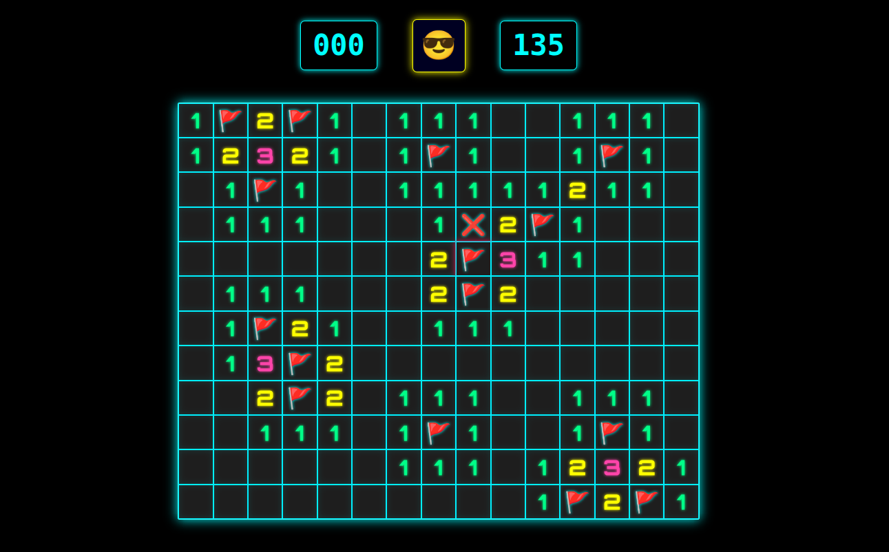

## 💣 💣 💣 Buscabombas - Versión JavaScript 💣 💣 💣

<!--  -->

## 🕹️ ¿Qué es _Buscabombas_?

- _Buscabombas_ es un juego interactivo inspirado en el clásico **Buscaminas**,   desarrollado con **HTML, CSS y JavaScript**.
- Sumergite en este desafío de lógica y estrategia, donde cada clic cuenta.
- Tu misión es clara: **revelar todas las casillas sin detonar una sola bomba**.
- ¿Estás listo para demostrar tu precisión y agudeza mental?

### 🎯 Objetivo

- Descubrí todas las casillas **que no tienen bombas**.
- Si hacés clic en una bomba... **💥 BOOM, perdiste.**

### 🔢 ¿Que significan los números?

- Cada número representa **cuántas bombas hay en las casillas que lo rodean**.
- Usalos como pistas para deducir dónde están las trampas.

### 🖱️ Controles & Indicadores

- **Clic izquierdo:** Revela una casilla.
- **Clic derecho:** Coloca o quita una bandera 🚩 en casillas sospechosas.
- **Contador de minas:** Muestra cuántas bombas quedan por encontrar (arriba a la izquierda).
- **Botón de reinicio:** Reinicia la partida cuando quieras con el emoji 😀.

### 🔥 Tips para ganar como un experto

- Observá bien los números: ¡todo es lógica!
- Si un número coincide con la cantidad de banderas a su alrededor, las demás casillas cercanas están a salvo.
- A veces toca arriesgar... pero hacelo con estrategia.

## Listo para poner a prueba tu ingenio?  [👉 Hacé clic acá para jugar!](https://buscabombas.vercel.app/)

Creado por [Joan Simonutti](https://www.linkedin.com/in/joansimonutti/) | 2025

