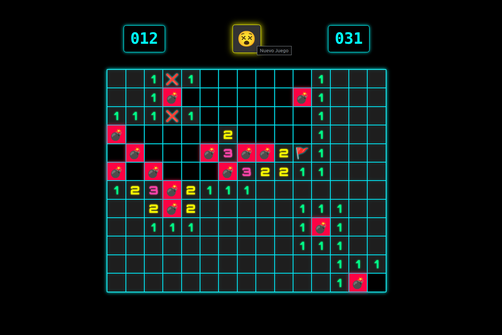

## 💣 Buscabombas - JavaScript

Versión del clásico juego Buscaminas, desarrollada con HTML, CSS y JavaScript.
El objetivo es encontrar todas las minas en el tablero sin hacerlas explotar, utilizando lógica y marcando cuidadosamente las casillas sospechosas.

- **Jugalo online aquí [Buscabombas](https://buscaminas-java-script.vercel.app/)**

---

Creado por [Joan Simonutti](https://www.linkedin.com/in/joansimonutti/) | 2025

